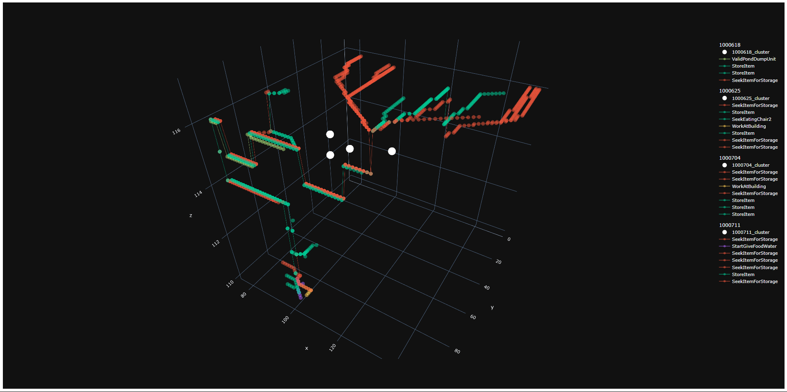

# pathViz

pathViz was born at the crossroads of data science, game development, and complex simulation algorithms. 

Its primary goal is to provide an accessible tool for analyzing dwarven path activity in Dwarf Fortress. The purpose is to improve overall understanding of dwarf activity within the context of a player's unique fort structure.

pathViz provides both a `CLI` & `GUI`, for preference
<br>


*A visual generated by pathViz, overlaid with the game screen, using the first year of a new fort as the subject*
<br>


*A screenshot of the updated pathViz GUI*

Related resources include:
- [DFHack/devel/unit-path](https://github.com/DFHack/scripts/blob/master/devel/unit-path.lua) - a script located at `devel/unit-paths` in DFHack that visualizes the internal path of a selected dwarf, using the in-game GUI

## Setup

Dependencies:
- [Python 3.10.11](https://www.python.org/downloads/release/python-31011/)
- [pip](https://pypi.org/project/pip/)
- [DFHack](https://docs.dfhack.org/en/stable/docs/Installing.html#installing) - can be installed directly from Steam, if using DF premium

> [pipenv 2023.12.1](https://pypi.org/project/pipenv/2023.12.1/) is an additional package management dependency installed automatically when running the startup script `./pathViz.ps1` with Powershell.

First, download the latest release of [pathViz](https://github.com/crystalfiction/pathViz/releases) to an easily accessible directory. *Make sure this directory is not within a cloud drive, or you will most likely encounter file permissions issues.*

See below depending on `GUI` or `CLI` usage.

## GUI

> ***The `GUI` does not currently support visualization options, and will only output the default visualization type.***

For the `GUI`, there is minimal setup involved. All you need to do is locate the `pathViz.ps1` file and run it with `Powershell`.

You can do this via the File Explorer by right-clicking the file and selecting `Run with Powershell`, or you can open up your command-line and run `./pathViz.ps1`.

When prompted, enter `gui`.

> ***IMPORTANT***<br>
> If Dwarf Fortress is already running, you will need to go into the game, open the dfhack console with `ctrl-shift-p`, and run
> ```lua
> :lua require('script-manager').reload()
> ```
>
> This tells dfhack to reload all scripts in the `dfhack/scripts/` directory, ensuring that pathViz is recognized.

Enter the path to your Dwarf Fortress game directory, then follow the `gui` instructions.

## CLI

Locate the `pathViz/.env` file, insert the path to your Dwarf Fortress game directory to `DF_PATH`, and observe its other variables
- `DF_PATH`: the system path to your Dwarf Fortress game directory
- `DATA_DIR`: the directory in which pathViz will log path data from the game
- `OUTPUT_DIR`: the directory in which pathViz will save generated visuals and statistics
- ***You do not need to change these, unless you would prefer alternative directory names***
<br>

Once you've specified the `DF_PATH`, you need to run the `pathViz.ps1` file at least once via `Powershell`, then specify the `cli` option when prompted.

This automatically initializes the `DFHack` script `logPaths.lua` and places it in the necessary directory of your game folder.

> ***IMPORTANT***<br>
> If Dwarf Fortress is already running, you will need to go into the game, open the dfhack console with `ctrl-shift-p`, and run
> ```lua
> :lua require('script-manager').reload()
> ```
>
> This tells dfhack to reload all scripts in the `dfhack/scripts/` directory, ensuring that pathViz is recognized.

### Start logging paths...
From the dfhack console (`ctrl-shift-p`) run
```lua
-- logs paths once per in-game week
-- the current day when enabled is the first snapshot
enable logPaths
```

### Load some data
```bash
# make sure your terminal is still in the pipenv shell
python pathViz.py load
```

### Visualize some data
```bash
python pathViz.py viz
```

Accepted arguments:
- `--g` - color each unique path by its path goal - Default: `False`
- `--c`: generate clusters for each snapshot using KMeans - Default: `False`
- `--heat`: generate a heatmap using the entire snapshot collection - Default: `False`
- `--limit`: limit the number of snapshots visualized - Default: `0`
- `--orient`: orient the limitation by "top," starting from the earliest snapshot, or "btm" starting from the latest - Default: `btm`

Simple example
```bash
# limit to 3 snapshots: --limit 3,
# starting from the latest snapshot: --orient btm
python pathViz.py viz --limit 3 --orient btm
```

More complex example
```bash
# limit to 10 snapshots: --limit 10,
# starting from the earliest(top) snapshot: --orient top,
# including snapshot clusters: --c,
# grouped by goal: --g
python pathViz.py viz --limit 4 --orient btm --c --g
```

The output, using my fort as data


### Generate some stats
```bash
python pathViz.py stats
```

Returned stats example
```bash
-----------------------------------
pathViz Stats
-----------------------------------
'Total avg dist travelled: 20.1'

           avg_dist         common_goal
snapshot
001000625     12.57  SeekItemForStorage
001000704     20.00           StoreItem
001000711     27.71  SeekItemForStorage

'Most common goal: SeekItemForStorage'

                    avg_dist
goal
SeekItemForStorage     28.27
StoreItem              15.00
StartGiveFoodWater     11.00
WorkAtBuilding          5.00
SeekEatingChair2        0.00

-----------------------------------
```


### Clear your snapshots
```bash
python pathViz.py clear
```

`clear` mode intentionally leaves path log files in the `DATA_DIR` persistent.
- This means you <u>_will need to manually relocate log files in the `DATA_DIR` if you do not want them considered when `load` is called_</u>
- Either back them up to a new folder, or simply delete them


## Screenshots


*A top-down perspective*


*A skewed, 3D perspective for scale*


*A zoomed-in, 3D perspective. We can see overall fort structure beginning to form.*


*A view demonstrating the heatmap functionality*


*A view demonstrating clustering through K Means*


## Development

[Current Roadmap](https://github.com/crystalfiction/pathViz/issues)

pathViz is a passion project, but I do aim to provide updates depending on community feedback and how quickly new feature concepts form.

Feel free to contribute, or reach out with any questions/ideas.