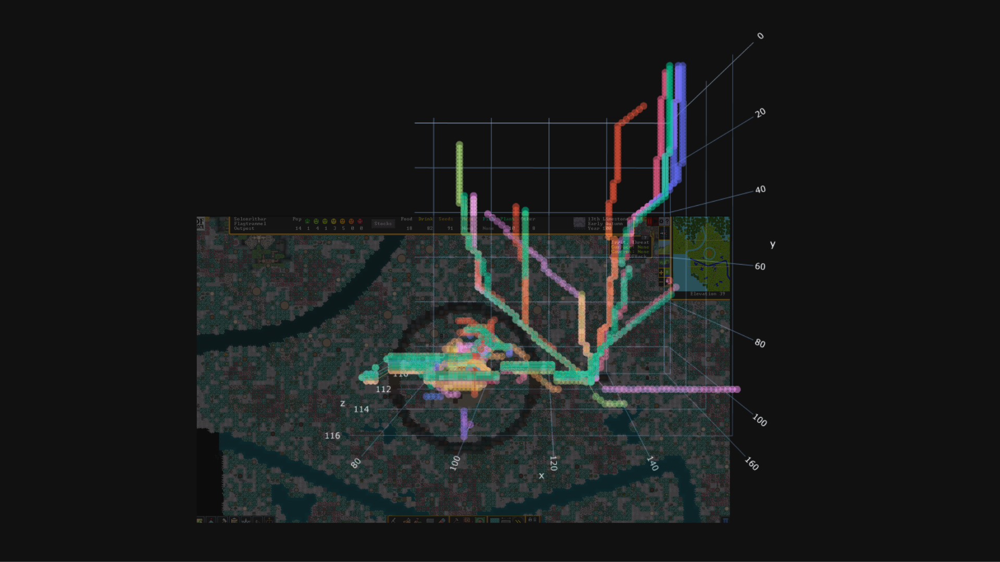
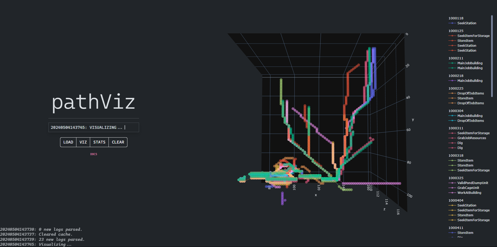
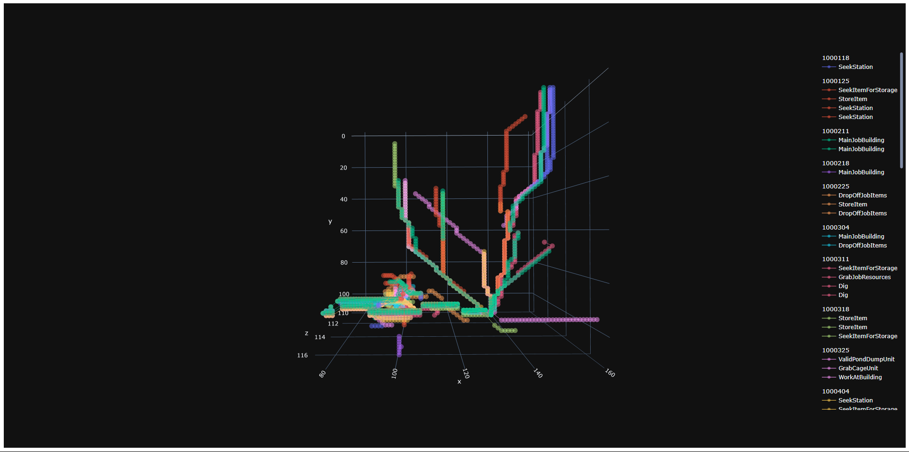
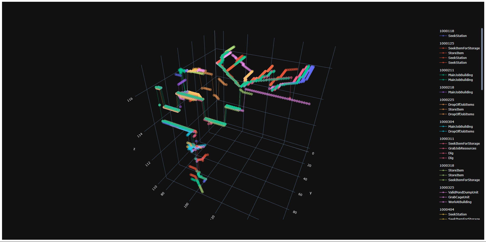
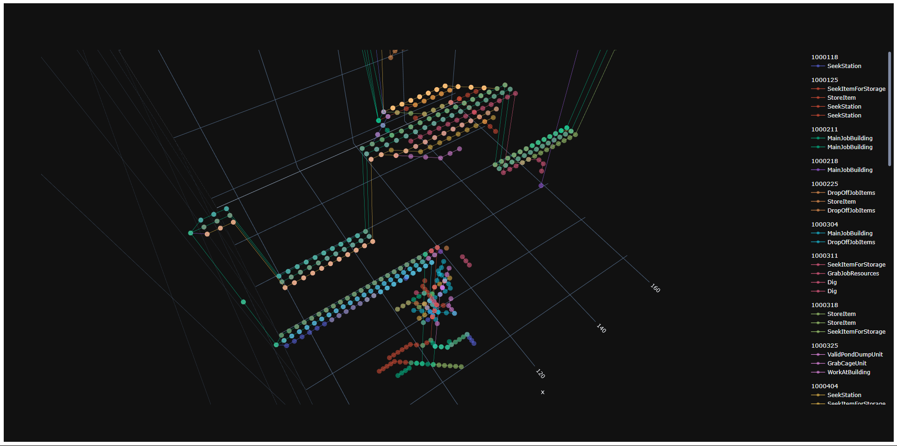
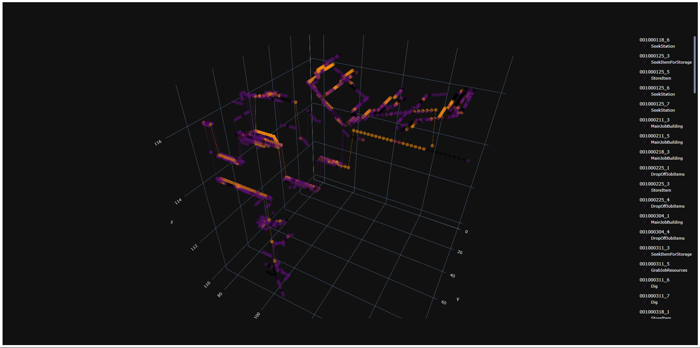
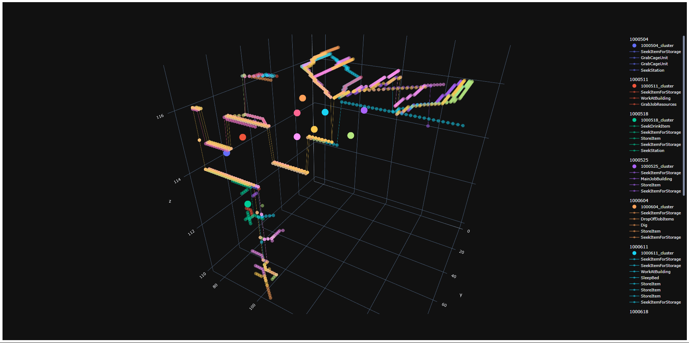

# pathViz

pathViz was born at the crossroads of data science, game development, and complex simulation algorithms. 

Its primary goal is to provide an accessible tool for analyzing dwarven path activity in Dwarf Fortress. The purpose is to improve overall understanding of dwarf activity within the context of a player's unique fort structure.

pathViz provides both a `CLI` & `GUI`, for preference
<br>


*A visual generated by pathViz, overlaid with the game screen, using the first year of a new fort as the subject*
<br>


*A screenshot of the updated pathViz GUI*

Related resources include:
- [DFHack/devel/unit-path](https://github.com/DFHack/scripts/blob/master/devel/unit-path.lua) - a script located at `devel/unit-paths` in DFHack that visualizes the internal path of a selected dwarf, using the in-game GUI

## Setup

Install [Python 3.10.11](https://www.python.org/ftp/python/3.10.11/python-3.10.11-amd64.exe)
1. Check the box `Add python.exe to system PATH` at the bottom
2. Then hit `Install Now`

> Verify the correct version of Python is installed by opening `Terminal` and running the code below. Then, verify its output is `Python 3.10.11`.
> ```bash
> # running this
> python -V
> ```

Once the correct version of `Python` is installed, download the latest release of pathViz [here](https://github.com/crystalfiction/pathViz/releases). ***Make sure the location you download it to isn't within OneDrive or a cloud directory.***

A [Simple](#simple) setup is provided below for those with minimal-no programming experience. Otherwise, see [Full](#full).

### Simple

> Simple setup provides the quickest way to get `pathViz` up and running. However, it only supports `GUI` interaction. See `Full` for `CLI` usage.

Screenshots of the setup process can be found [here](simple_setup.md).

Un-zip the `pathViz.zip` file, then `right-click` on the folder and select `Open in Terminal`.

In the `Terminal`, run
```bash
./pathViz.ps1
```

> **If running `./pathViz.ps1` does _not_ work:**
> <br>
> Please put in an Issue -> Bug Report, or DM me directly via [Reddit](https://www.reddit.com/user/crystalfiction/)

Once `pathViz`'s dependencies are done installing, the `GUI` should automatically start within a new browser window/tab. Follow the `GUI` instructions to complete setup, and see below for [Usage](#usage).


### Full

> Full setup will allow usage with both the `CLI` & `GUI` modules, but requires prior experience navigating the command-line and editing scripts.

Un-zip the `pathViz` archive and start installing its dependencies:
```bash
# make sure you're in the pathViz directory
cd <path_to_pathViz>/pathViz

# install pipenv to manage Python packages + venv
pip install pipenv

# install dependencies with pipenv
pipenv install

# finally, start the pipenv virtual environment
pipenv shell
```

Locate the `.env` file and see comments below:
```bash
# locate the system path to your Dwarf Fortress
# game directory, then set DF_PATH to the system path
DF_PATH=""
# for example...
EXAMPLE_DF_PATH="C:\Program Files (x86)\Steam\steamapps\common\Dwarf Fortress"

# optional variables specifying the directory
# names pathViz will use to write data
DATA_DIR="data/"
OUTPUT_DIR="output/"
```

If you are planning on using the `GUI`, make sure to install the `NPM` packages as well
```bash
# go into the GUI app and install node packages
cd gui
npm install

# return to the root directory
cd ..
```

> The `GUI` can then be accessed at any time via
> ```bash
> python gui.py
> ```

To verify your setup, try to load some log data (which shouldn't exist yet)
```bash
python cli.py load
```

Locate your DF directory that you provided in the `.env` file, then go to `.../Dwarf Fortress/hack/scripts` and check that `logPaths.lua` exists.

To verify further... open `logPaths.lua` and ensure...
```lua
// default
local filePrefix = ""

// is updated to (using default directory names)...
local filePrefix = "C:\\<path_to_pathViz>\\data\\logs\\"
```

See below for [Usage](#usage).

## Usage

Once `pathViz` is setup, workflow mainly revolves around:
- telling `pathViz` to start or stop logging paths
- doing something with the path data, depending on the mode selected

### Start logging paths
> ***IMPORTANT***<br>
> If your game client was running during the setup process...
> In your game client, open the `DFHack` console by pressing `ctrl-shift-p`, then run the lua code below to rescan all `DFHack` scripts
> ```lua
> :lua require('script-manager').reload()
> ```

When `logPaths` is enabled, it will immediately log all active paths in-game, then continue to log them once every 7 days in-game.

- enable or disable the `logPaths` script by running `enable logPaths` or `disable logPaths` from the `DFHack` console, respectively.
- Check whether the `logPaths` script is enabled by running `logPaths` at any time from the `DFHack` console.


### Modes

> If using the `CLI`, help can be viewed at any time via `python cli.py --help`.

#### Load
`load` parses and logs each log file's path data to the current `snapshot`.
- A `snapshot` is a collection of paths, grouped by the in-game date in which they were logged.

##### CLI Usage
```bash
python cli.py load
```

#### Viz
`viz` analyses existing path data and generates a visual depending on the passed `options`.
- Currently, the `GUI` only supports default visuals, so there are no `options` to pass.
- By default, the generated visual groups paths by the week in which they were logged.

##### CLI Usage
Available `options`:
- `--g`: group paths by Path Goal (the activity associated with the individual path)
- `--c`: generate K-Means clusters for each snapshot. 
  - K-Means clustering is useful in evaulating the overall 'similarity' of paths between logs. Each group will contain a `cluster` which represents the "estimated central point" of each `log`'s paths.
- `--heat`: generate a heatmap, highlighting areas which are most likely to contain high path density.
- `--limit`: limit the number of `logs` used when generating a visual; Default: `0`.
- `--orient`: orient the `logs` limitation, where `top` is the earliest `log` recorded and `btm` is the latest; Default: `btm`.
- `--saved`: specify whether to include all saved & current snapshots, or just current. By default, only the current snapshot is included.

```bash
# generate a visual,
# limit to 10 logs,
# starting from the earliest log
python cli.py viz --limit 10 --orient top

# generate a visual
# limit to 5 logs,
# starting from the latest log,
# and generate clusters
python cli.py viz --limit 5 --orient btm --c
```

#### Stats

`stats` analyses existing path data and generates some key metrics.
- When run through the `GUI`, the returned stats are saved as individual files in the `output/` folder.

##### CLI Usage
Available `options`:
- `--limit`: limit the number of `logs` used when generating stats; Default: `0`.
- `--orient`: orient the `logs` limitation, where `top` is the earliest `log` recorded and `btm` is the latest; Default: `btm`.
- `--saved`: specify whether to include all saved & current snapshots, or just current. By default, only the current snapshot is included.

```bash
# generate some stats
python cli.py stats

## EXAMPLE OUTPUT
-----------------------------------
pathViz Stats
-----------------------------------
'Total avg dist travelled: 20.1'

           avg_dist         common_goal
snapshot
001000625     12.57  SeekItemForStorage
001000704     20.00           StoreItem
001000711     27.71  SeekItemForStorage

'Most common goal: SeekItemForStorage'

                    avg_dist
goal
SeekItemForStorage     28.27
StoreItem              15.00
StartGiveFoodWater     11.00
WorkAtBuilding          5.00
SeekEatingChair2        0.00

-----------------------------------
```

#### Snapshot

`snapshot` provides a way to subset your path data by moving it to its own unique directory. This is mostly useful when you have logged a series of paths and would like to separate them from a new, incoming series (i.e. comparing time periods).

- If `DATA_DIR` was not changed from the default value, each `snapshot` will be located at `data/<snapshot_name>/`.
  - The directory contains files representing this `snapshot`'s path data (both `.csv` & `.json`).

##### CLI Usage
```bash
python cli.py snapshot
```


#### Clear

`clear` wipes the current `snapshot` from memory.
- ***It does not remove path log files.***
  - This means that if you would like to delete any recorded paths, you will have to do so manually by deleting the file containing them located in `data/logs/`

##### CLI Usage
```bash
python cli.py clear
```

## Screenshots


*A top-down perspective*


*A skewed, 3D perspective for scale*


*A zoomed-in, 3D perspective. We can see overall fort structure beginning to form.*


*A view demonstrating the heatmap functionality*


*A view demonstrating clustering through K Means*


## Development

[Current Roadmap](https://github.com/crystalfiction/pathViz/issues)

pathViz is a passion project, but I do aim to provide updates depending on community feedback and how quickly new feature concepts form.

Feel free to contribute, or reach out with any questions/ideas.